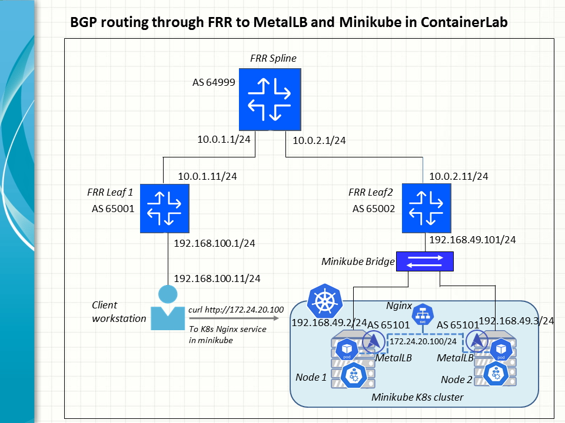

A handy ContainerLab environment is set up to allow us to experiment with the use of MetalLB in BGP mode. It is provisioned as a load balancer to manage access from an external client to a Kubenetes service via a VIP address.

Central to the lab is a FRR fabric that connect a client network to a minikube K8s cluster through BGP routes. The topology looks like a miniture Internet connection where the upstream FFR leaf switches behave as Internet service providers for the client and Kubernetes while the FRR spine switch assumes the role of an Internet backbone. Altogether they cooperate to establish BGP connectivity end to end, similar to what is being achieved on the Internet at large.

