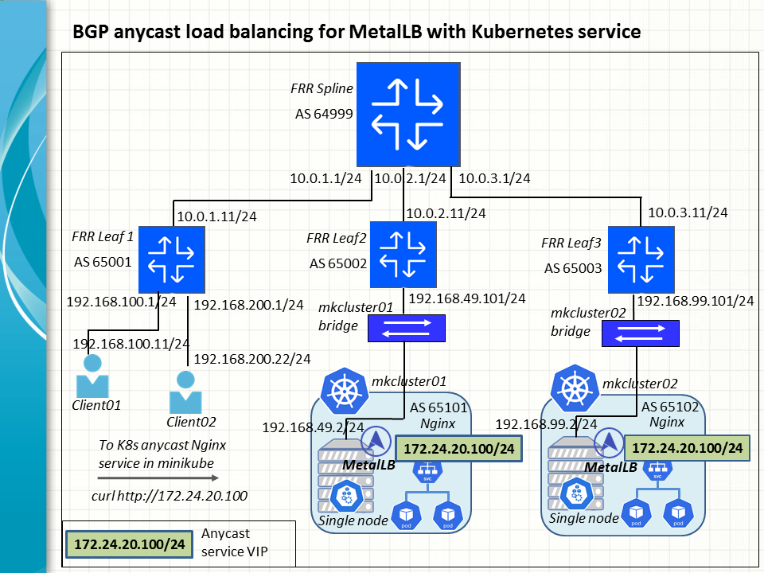

Our next task is to set up BGP anycast routes for MetalLB to distribute workloads between multiple instances of a Kubernetes service. To this end, a new minikube K8s cluster is added to the ContainerLab topology to host the nginx service with the same virtual IP (VIP) as the one advertised by MetalLB on the first cluster.

### Key success factors

There are three key success factors to accomplish the task. First, MetalLB speakers will be deployed on both minikube clusters to run in the BGP mode to advertise the nginx VIP to the upstream FRR switches. 

In addition, the FRR spine switch will accept the two BGP routes destined to the anycast VIP on the respective minikube clusters and install them as ECMP routes in the kernel FIB table.

Finally, the kernel of the FRR spine switch will use a suitable hash policy to spread different connections to the anycast VIP between the ECMP routes.

### Lab inventory

The [baseline lab](../containerlab_frr_mk02.png) is extended to include a second minikube K8s cluster, mkcluster02 and a third FRR leaf switch, frrleaf3, which connects the new cluster to the FRR fabrics.

<table>
	<thead>
		<tr>
			<th scope="col">ContainerLab Node</th>
			<th scope="col">Network Configuration</th>
			<th scope="col">Creator</th>
		</tr>
	</thead>
	<tbody>
		<tr>
			<td aligh="left">Client workstation</td>
			<td aligh="left">Host IP: 192.168.100.11/24</td>
			<td aligh="left">Created by ContainerLab</td>
		</tr>
    <tr>
			<td aligh="left">Client02 workstation</td>
			<td aligh="left">Host IP: 192.168.200.22/24</td>
			<td aligh="left">Created by ContainerLab</td>
		</tr>
		<tr>
			<td aligh="left">FRR Leaf 1</td>
			<td aligh="left">Network Prefix: 192.168.100.0/24 <br>
        Network Prefix: 192.168.200.0/24 <br>
				Network Prefix: 10.0.1.0/24 <br>
				BGP ASN: 65001
			</td>
			<td aligh="left">Created by ContainerLab</td>
		</tr>
		<tr>
			<td aligh="left">FRR Spine</td>
			<td aligh="left">Network Prefix: 10.0.1.0/24 <br>
				Network Prefix: 10.0.2.0/24 <br>
        Network Prefix: 10.0.3.0/24 <br>
				BGP ASN: 64999
			</td>
			<td aligh="left">Created by ContainerLab</td>
		</tr>
		<tr>
		    <td aligh="left">FRR Leaf 2</td>
			<td aligh="left">Network Prefix: 10.0.2.0/24 <br>
				Network Prefix: 192.168.49.0/24 <br>
				BGP ASN: 65002
			</td>
			<td aligh="left">Created by ContainerLab</td>
		</tr>
    <tr>
		    <td aligh="left">FRR Leaf 3</td>
			<td aligh="left">Network Prefix: 10.0.3.0/24 <br>
				Network Prefix: 192.168.99.0/24 <br>
				BGP ASN: 65003
			</td>
			<td aligh="left">Created by ContainerLab</td>
		</tr>
		<tr>
		    <td aligh="left">Minikube docker bridge</td>
			<td aligh="left">Network Prefix (transparent): Network Prefix: 192.168.49.0/24
			</td>
			<td aligh="left">Created in advance by Minikube</td>
		</tr>
    <tr>
		    <td aligh="left">Minikube docker bridge</td>
			<td aligh="left">Network Prefix (transparent): Network Prefix: 192.168.99.0/24
			</td>
			<td aligh="left">Created in advance by Minikube</td>
		</tr>
		<tr>
		    <td aligh="left">Minikube K8s cluster01 single node</td>
			<td aligh="left">Host IP: 192.168.49.2/24
			</td>
			<td aligh="left">Created in advance by Minikube</td>
		</tr>
		<tr>
		    <td aligh="left">Minikube K8s cluster02 single node</td>
			<td aligh="left">Host IP: 192.168.99.3/24
			</td>
			<td aligh="left">Created in advance by Minikube</td>
		</tr>
	</tbody>
</table>

Assume the Minikube and ContainerLab packages have been installed on a suitable Linux platform like Ubuntu 22.04 (jammy). The subsequent steps to be taken to build and test the BGP anycast routes are similar to those performed in the [baseline exercise](../README.md).

### Deploy Minikube K8s clusters

For simplicity and a smaller footprint, both clusters are reduced to a single node each. Moreover, the node of the second cluster, mkcluster02, is to be assigned a user-chosen IP, 192.168.99.2.

```
minikube start --driver=docker --nodes 1 -p mkcluster01 --cpus=1 --force
minikube start --driver=docker --nodes 1 -p mkcluster02 --static-ip 192.168.99.2 --cpus=1 --force
```

```
keyuser@ubunclone:~/FRR_MetalLB_BGP_Minikube/anycast$ minikube profile list
┌─────────────┬────────┬─────────┬──────────────┬─────────┬────────┬───────┬────────────────┬────────────────────┐
│   PROFILE   │ DRIVER │ RUNTIME │      IP      │ VERSION │ STATUS │ NODES │ ACTIVE PROFILE │ ACTIVE KUBECONTEXT │
├─────────────┼────────┼─────────┼──────────────┼─────────┼────────┼───────┼────────────────┼────────────────────┤
│ mkcluster01 │ docker │ docker  │ 192.168.49.2 │ v1.34.0 │ OK     │ 1     │                │                    │
│ mkcluster02 │ docker │ docker  │ 192.168.99.2 │ v1.34.0 │ OK     │ 1     │ *              │ *                  │
└─────────────┴────────┴─────────┴──────────────┴─────────┴────────┴───────┴────────────────┴────────────────────┘
keyuser@ubunclone:~/FRR_MetalLB_BGP_Minikube/anycast$
```

### Deploy ContainerLab topology
